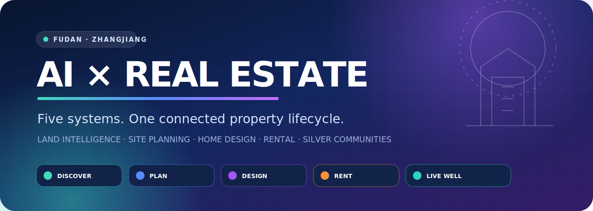
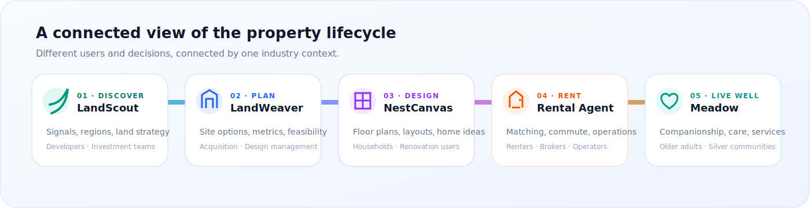
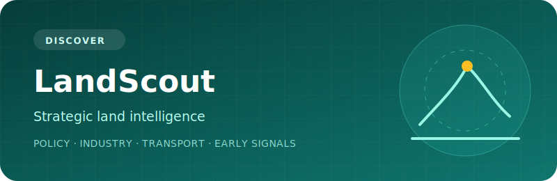
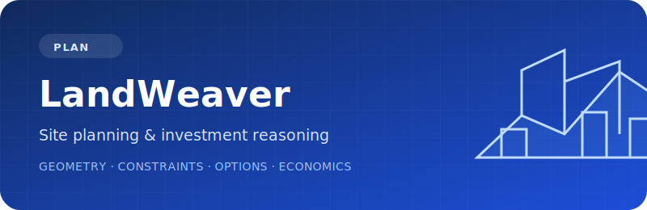
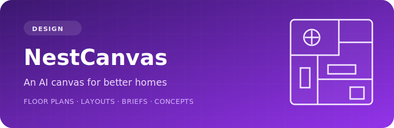
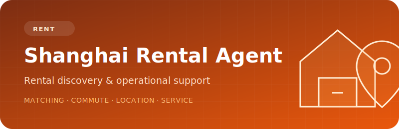
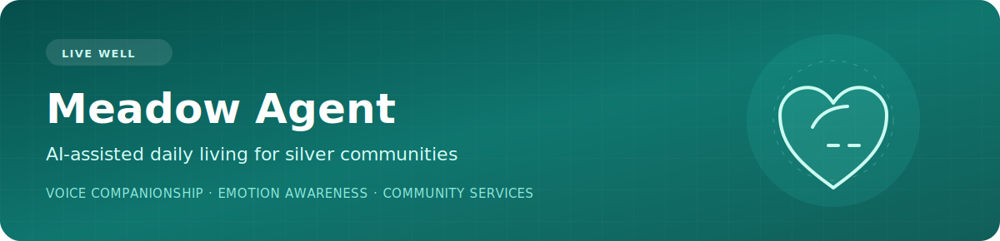

  

  <a href="README.md"><strong>English</strong></a> ·
  <a href="README.zh-CN.md">简体中文</a>

  
  
  
  

## One lab, five perspectives

This collection grew from my month-long internship at **Fudan University’s Zhangjiang Institute**, where I worked under **Suli Ye’s guidance** to explore how AI can support practical real-estate workflows.

The five systems do not repeat the same idea. They serve different people, property types, and stages of the value chain—from identifying promising regions before land acquisition, to planning a site, designing a home, navigating the rental market, and supporting better daily life in silver communities.

  

## Project atlas

<table>
  <tr>
    <td width="50%" valign="top">
      
      <h3>01 · LandScout</h3>
      
<strong>Strategic land intelligence before acquisition.</strong>

      
LandScout reads public policy, industry, transport, planning, and land-supply signals to help developers identify regions where future housing demand may emerge.

      
<strong>Users:</strong> developers and investment teams <strong>Stage:</strong> regional discovery and early land strategy

      

        
        
      

    </td>
    <td width="50%" valign="top">
      
      <h3>02 · LandWeaver Agent</h3>
      
<strong>Site planning, feasibility, and investment reasoning.</strong>

      
LandWeaver turns parcel boundaries, planning constraints, building prototypes, and economic assumptions into comparable site options with verifiable geometry and financial metrics.

      
<strong>Users:</strong> acquisition, design-management, and concept teams <strong>Stage:</strong> site planning and investment evaluation

      

        
        
      

    </td>
  </tr>
  <tr>
    <td width="50%" valign="top">
      
      <h3>03 · NestCanvas Agent</h3>
      
<strong>An AI canvas for home layout and early design.</strong>

      
NestCanvas helps buyers, renters, and renovators turn floor plans and natural-language needs into editable briefs, furniture layouts, design reviews, and concept visuals.

      
<strong>Users:</strong> households, renters, and renovation clients <strong>Stage:</strong> spatial design and home planning

      

        
        
      

    </td>
    <td width="50%" valign="top">
      
      <h3>04 · Shanghai Rental Agent</h3>
      
<strong>Rental discovery and operational support for Shanghai.</strong>

      
The agent connects housing needs, budget, commute preferences, location services, property information, and safety-aware operational workflows for renters and real-estate teams.

      
<strong>Users:</strong> renters, brokers, and rental operators <strong>Stage:</strong> leasing, matching, and service operations

      

        
        
      

    </td>
  </tr>
  <tr>
    <td colspan="2" valign="top">
      
      <h3>05 · Meadow Agent</h3>
      
<strong>AI-assisted daily living for silver communities.</strong>

      
Meadow explores how voice companionship, emotion-aware interaction, and carefully confirmed service workflows can support older adults. Its broader direction is community-scale senior living: helping future silver communities provide warmer, more accessible, and more responsive residential services.

      
<strong>Users:</strong> older adults, families, and silver-community service teams <strong>Stage:</strong> resident experience and community living services

      

        
        
      

    </td>
  </tr>
</table>

## Explore the collection

The buttons above open each source repository and live prototype. Render free instances may sleep when inactive, so the first visit can take several seconds to wake up.

These projects are research and product prototypes. They do not replace professional planning, investment, legal, structural, medical, or community-care advice.
